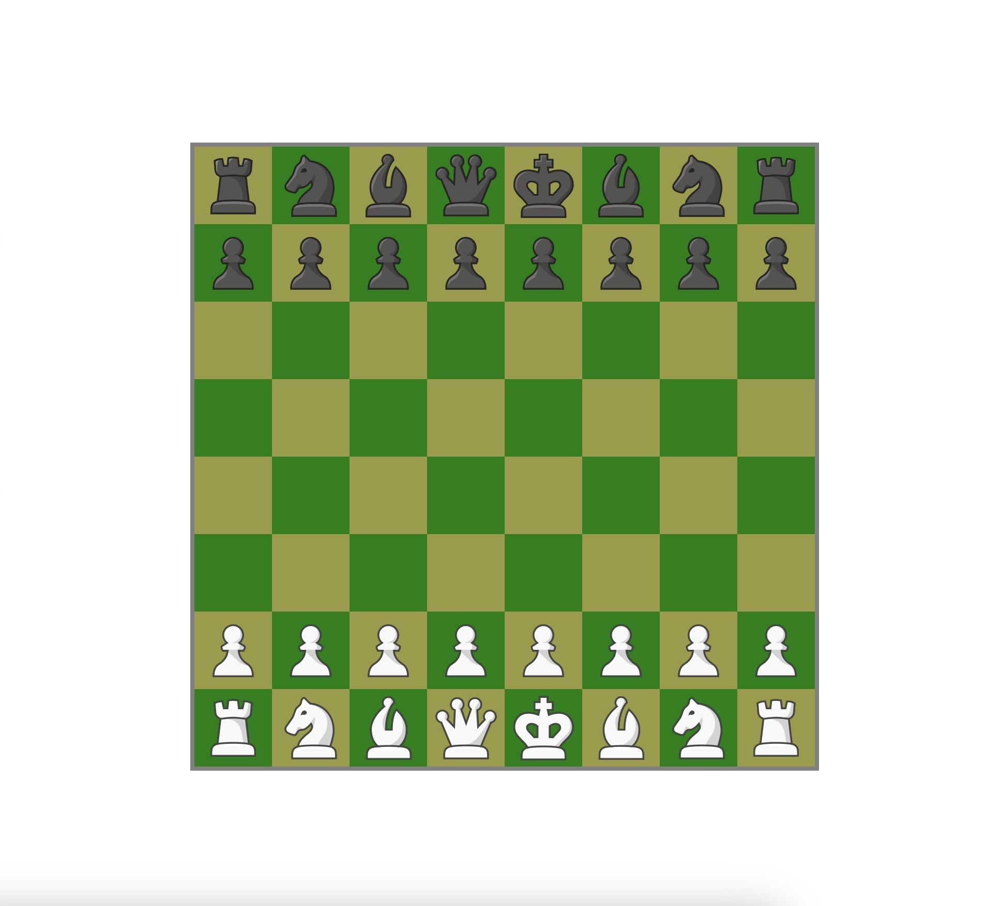

# [JOGUE AQUI!](https://lucasberr.github.io/Chess/)

# Xadrez em JavaScript

Bem-vindo ao meu projeto de Xadrez em JavaScript! Este é um jogo de xadrez básico, implementado em JavaScript e HTML. Ele permite que você jogue xadrez contra outra pessoa em um navegador da web localmente.

## Funcionalidades

- Interface de usuário simples para jogar xadrez.
- Suporte para jogar entre dois jogadores.
- Peças de xadrez clássicas.
- Regras de movimento de peças implementadas.

## Como Jogar

1. Abra o arquivo `index.html` no seu navegador.
2. Você verá o tabuleiro de xadrez com todas as peças posicionadas.
3. Clique em uma peça para selecioná-la.
4. Em seguida, clique na casa para onde deseja movê-la. Se for um movimento válido, a peça será movida.
5. Continue alternando entre os jogadores até que um jogador vença.

## Personalizações

Sinta-se à vontade para personalizar e estender este projeto. Alguns recursos adicionais que você pode adicionar incluem:

- Implementar lógica de xeque e xeque-mate.
- Adicionar um contador de movimentos e verificação de empate.
- Melhorar a interface do usuário com estilos e animações atraentes.

## Créditos

Este projeto foi criado por Lucas Tabelli Berr.

Inspiração e recursos:

- [chess.com](https://www.chess.com/)

## Contribuindo

Contribuições são bem-vindas! Sinta-se à vontade para abrir problemas ou enviar solicitações de pull para melhorar este projeto.

---
**Divirta-se jogando xadrez!**
